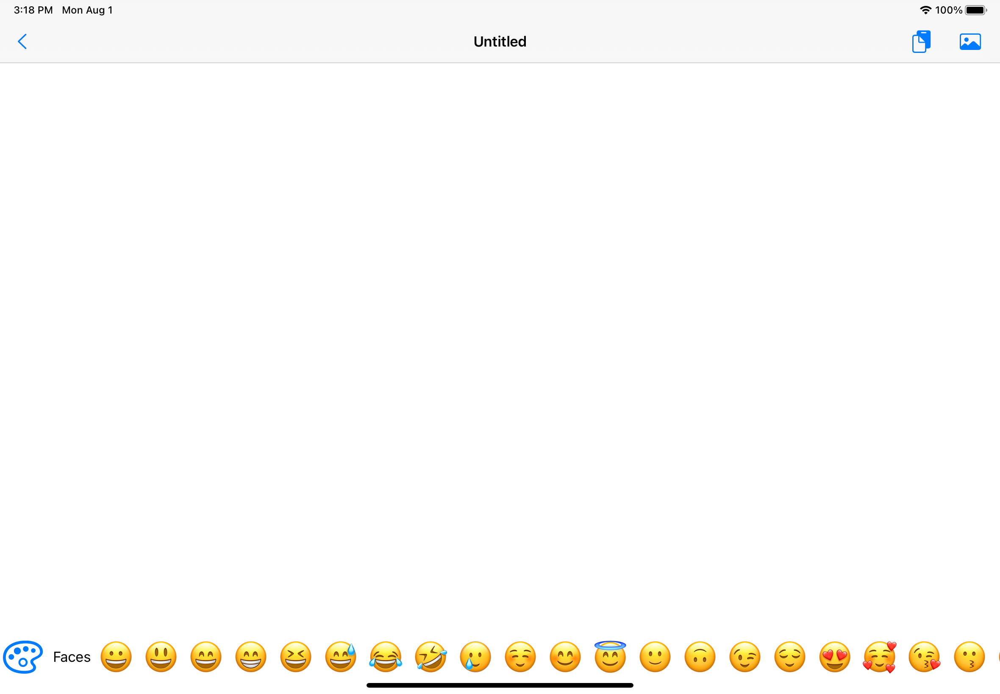
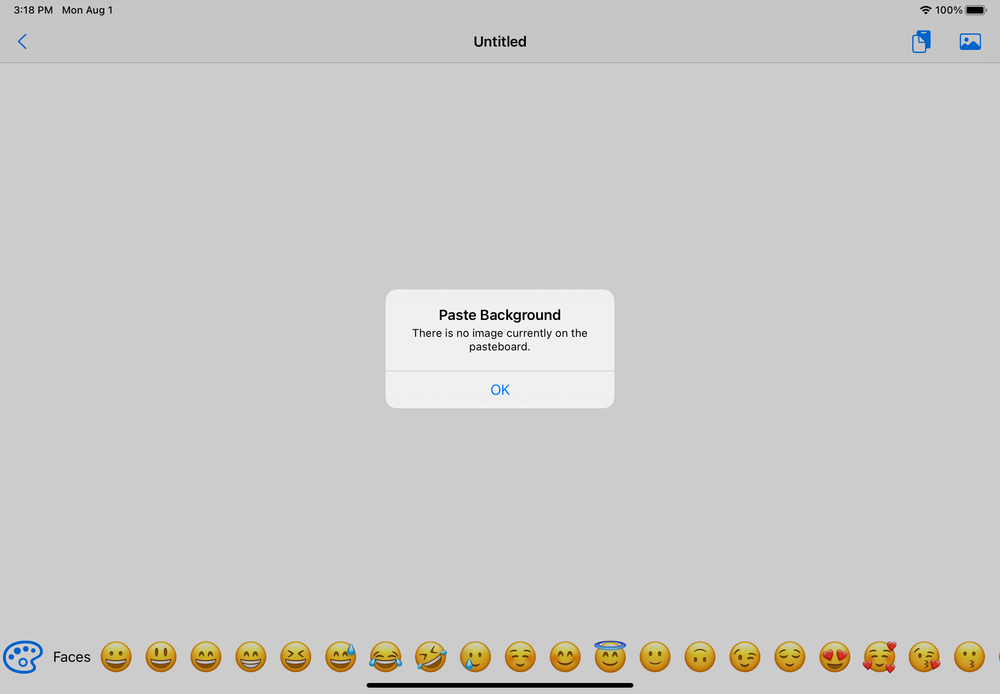
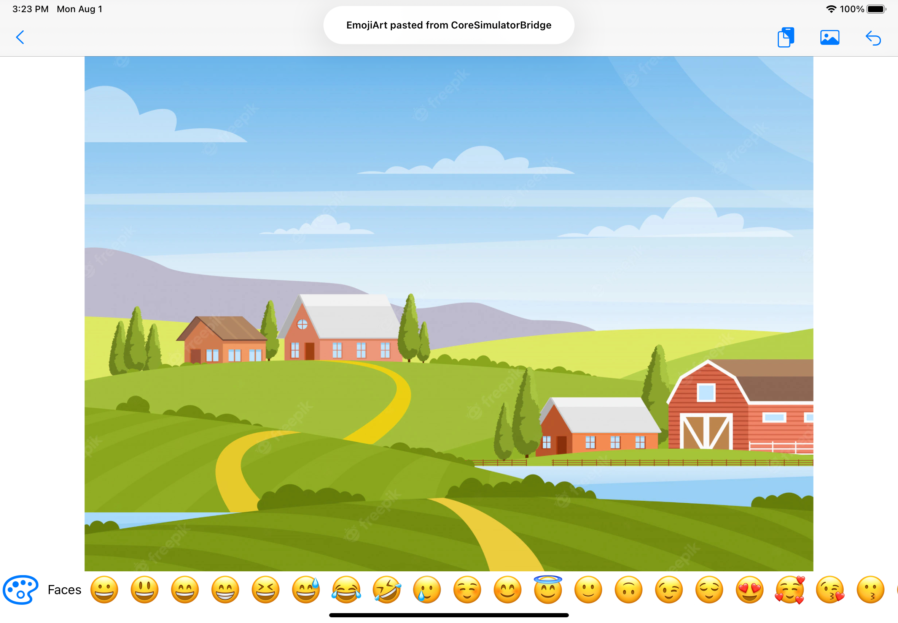
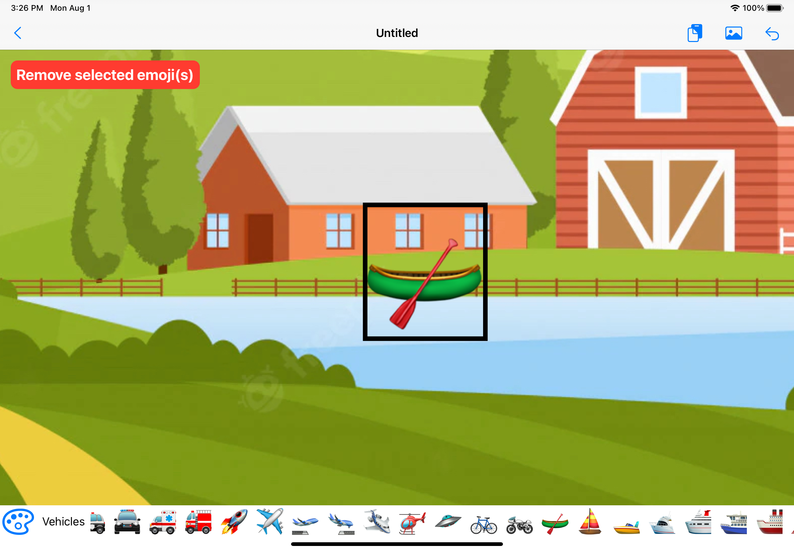

# EmojiArt

Цель этого приложения — рисовать смайлики для iOS. Моя основная цель состояла в том, чтобы научиться перетаскивать файлы в этом проекте. Проект построен с использованием Swift и использует SwiftUI.

